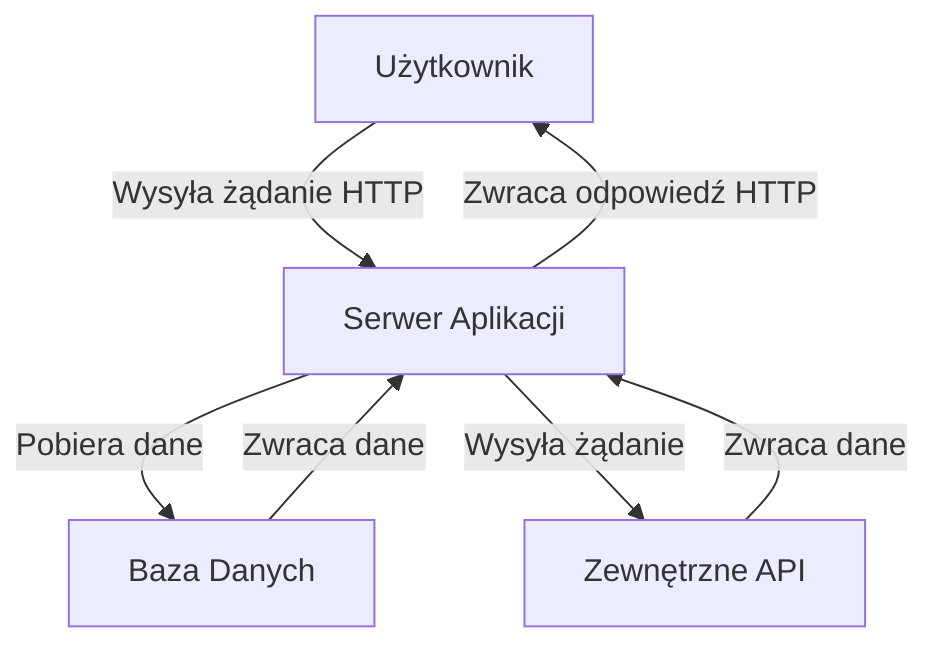

# Dokumentacja Techniczna Aplikacji do rekomendaji filmów

**Nazwa Aplikacji**:  Movie recommendations
**Wersja**:  1.0.0
**Data Utworzenia**:  11.11.2024
**Autor**:  Stefan Grzelec, Maks Buhai
**Repozytorium**:  https://github.com/Spoky03/movie-recommend

---

## 1. Wprowadzenie

### 1.1 Opis projektu
Aplikacja do oceniania i otrzymywania rekomendacji filmów na podstawie historii oglądania.

### 1.2 Cele i założenia aplikacji
- Stworzenie aplikacji umożliwiającej zapisywanie filmów które użytkownik objerzał
- Otrzymywanie rekomendacji na podstawie obejrzyanych filmów
- Otrzymywanie rekomendowanych filmów dla danego użytkownika na podstawie filmów obejrzanych wspólnie z jego znajomymi.
- Dzięki wielu nadmiarowym informacjom szczególnie w kolekcji `movies` możliwe jest zbudowanie użytecznego i intuicyjnego frontendu oraz szybki rozwój aplikacji w przyszłości.
### 1.3 Problemy
- Problematyczne okazało się tworzenie schematów kolekcji bazy danych na serwerze; Ze względu na restrykcje użycia ODM (Object Document Mapper) takiego jak `mongoose` które znacznie ułatwia tworzenie schematów oraz zarządzanie nimi.
## 2. Architektura Systemu

### 2.1 Ogólny Przegląd


### 2.2 Technologie
- **Frontend**: --
- **Backend**: Express.js
- **Baza Danych**: MongoDB

### 2.3 Komponenty Systemu
- **Serwer Aplikacji**: Obsługuje żądania HTTP, zarządza sesjami użytkowników, autoryzacją i autentykacją.
- **Baza Danych**: Przechowuje dane użytkowników, filmy, oceny, listy znajomych, rekomendacje i listy do obejrzenia.
- **Zewnętrzne API**: Integracja z zewnętrznymi API TMDB w celu pobierania informacji o filmach.

### 2.4 Przepływ Danych
1. Użytkownik wysyła żądanie HTTP do serwera aplikacji.
2. Serwer aplikacji przetwarza żądanie, wykonuje operacje na bazie danych lub zewnętrznych API.
3. Serwer aplikacji zwraca odpowiedź HTTP do użytkownika.

### 2.5 Środowisko Uruchomieniowe
- **Serwer**: Node.js
- **Chmura - Baza Danych**: MongoDB Atlas

### 2.6 Bezpieczeństwo
- **Autoryzacja i Autentykacja**: JWT, BCRYPT
- **Szyfrowanie**: HTTPS, szyfrowanie haseł

## 3. Frontend
***Nie zrealizowany***

---

## 4. Backend

### 4.1 Struktura Plików
`src/`

- `middleware`: np authorization
- `service`: zapytania do TMDB API
- `index`: główny plik
- `config`: zmienne środowiskowe i konfiguracja

### 4.2 Technologie i Biblioteki
- Express.js
- MongoDB
- AXIOS
- JWT
- BCRYPT

### 4.3 Endpoints API
Dokumentacja endpointów API 

#### Przykład:

| Metoda | Endpoint            | Opis                                  | Parametry          |
|--------|----------------------|---------------------------------------|---------------------|
| POST   | `/api/register`      | Tworzy nowego użytkownika             | `username`, `password`    |
| POST   | `/api/login`         | Loguje użytkownika i zwraca JWT       | `username`, `password`    |
| GET    | `/api/search?query=`        | Wyszukuje film po nazwie w bazie danych i wykonuje zapytanie do TMDB | `query=<nazwa filmu>`     |
| GET    | `/api/movies`        | Zwraca wszystkie filmy z bazy danych  | -                   |
| GET    | `/api/similar`       | Zwraca podobne filmy na podstawie ID  | `movieId`           |
| GET    | `/api/rate`          | Zwraca oceny użytkownika              | -                   |
| POST   | `/api/rate`          | Ocena filmu                           | `movieId`, `score`  |
| GET    | `/api/myMovies`      | Zwraca ocenione filmy użytkownika     | -                   |
| GET    | `/api/friends`       | Zwraca listę znajomych użytkownika    | -                   |
| POST   | `/api/friends`       | Dodaje znajomego                      | `friendUsername`    |
| DELETE | `/api/friends`       | Usuwa znajomego                       | `friendUsername`    |
| GET    | `/api/friends/mutualMovies` | Zwraca wspólne filmy znajomych | -                   |
| GET    | `/api/friends/recommendations` | Zwraca rekomendacje filmów na podstawie znajomych | `friend` |
| POST   | `/api/watchlist`     | Dodaje film do listy do obejrzenia    | `movieId`           |
| GET    | `/api/watchlist`     | Zwraca listę filmów do obejrzenia     | -                   |
### 4.4 Przykładowe Zapytania

#### Wyszukiwanie filmów
**Endpoint**: `/api/search?query=<nazwa filmu>`

**Przykład**:
```bash
curl -X GET "http://localhost:3000/api/search?query=django"
```
```json
[
    {
        adult: false,
        backdrop_path: "/5Lbm0gpFDRAPIV1Cth6ln9iL1ou.jpg",
        genre_ids: [
        18,
        37
        ],
        id: 68718,
        original_language: "en",
        original_title: "Django Unchained",
        overview: "With the help of a German bounty hunter, a freed slave sets out to rescue his wife from a brutal Mississippi plantation owner.",
        popularity: 106.147,
        poster_path: "/7oWY8VDWW7thTzWh3OKYRkWUlD5.jpg",
        release_date: "2012-12-25",
        title: "Django Unchained",
        video: false,
        vote _average: 8.2,
        vote_count: 26187
    },
    {
        title: "Viva! Django",
        ...other fields...
    }
]
```
**Przykład 2**:
```bash
curl -X GET "http://localhost:3000/api/friends/recommendations" -H "Authorization: Bearer <JWT_TOKEN>"
```

```json
{
    recommendations: [
        {
            backdrop_path: "/suaEOtk1N1sgg2MTM7oZd2cfVp3.jpg",
            id: 680,
            title: "Pulp Fiction",
            original_title: "Pulp Fiction",
            overview: "A burger-loving hit man, his philosophical partner, a drug-addled gangster's moll and a washed-up boxer converge in this sprawling, comedic crime caper. Their adventures unfurl in three stories that ingeniously trip back and forth in time.",
            poster_path: "/vQWk5YBFWF4bZaofAbv0tShwBvQ.jpg",
            media_type: "movie",
            adult: false,
            original_language: "en",
            genre_ids: [
                53,
                80
            ],
            popularity: 175.724,
            release_date: "1994-09-10",
            video: false,
            vote_average: 8.488,
            vote_count: 28193
        },
        ...5 innych rekomendacji...
    ],
    basedOn: "68718"
}
```
***klucz `basedOn` informuje o id filmu na podstawie którego wygenerowanie zostały polecane filmy. W tym przypadku id `68718` oznacza film `Django Unchained`***

Taka rekomendacja jest uzasadniona, ponieważ dane filmy mają wiele wspólnych mianowników. Reżyser, można je zakwalifikować jako modern westerny lub czarna komedia.

### 4.4 Autoryzacja i Autentykacja
JWT, BCRYPT

### 4.5 Walidacja Danych
Walidacja danych wejściowych odbywa się na poziomie endpointów API oraz w bazie danych MongoDB.

---

## 5. Baza Danych

### 5.1 Schemat Bazy Danych
Diagram ERD (Entity-Relationship Diagram)

### 5.2 Opis Tabel
Opis głównych tabel w bazie danych i ich pól.

- **users**: Przechowuje informacje o użytkownikach (username, password)
- **movies**: Przechowuje informacje o filmach (id, title, original_title, etc.)
- **rating**: Przechowuje oceny filmów przez użytkowników (userId, movieId, score)
- **friends**: Przechowuje informacje o znajomych użytkowników (user, friend, status)
- **recommendations**: Przechowuje rekomendacje filmów dla użytkowników (userId, movieId, updatedAt, basedOn)
- **watchlist**: Przechowuje listę filmów do obejrzenia dla użytkowników (userId, movieId)

### 5.3 Relacje
- **users** -> **friends**: Jeden użytkownik może mieć wielu znajomych.
- **users** -> **rating**: Jeden użytkownik może ocenić wiele filmów.
- **users** -> **recommendations**: Jeden użytkownik może mieć wiele rekomendacji.
- **users** -> **watchlist**: Jeden użytkownik może mieć wiele filmów na liście do obejrzenia.
- **movies** -> **rating**: Jeden film może być oceniony przez wielu użytkowników.
- **movies** -> **recommendations**: Jeden film może być rekomendowany wielu użytkownikom.
- **movies** -> **watchlist**: Jeden film może być na liście do obejrzenia wielu użytkowników.

---
## 6. Instrukcja uruchiomienia

### 6.1 Wymagania
- Node.js
- npm
- git

### 6.2 Konfiguracja
- **sklonowanie repozytorium**
    ```sh
    git clone https://github.com/Spoky03/movie-recommend
    cd movie-recommend
    ```
- **dodanie kluczy do pliku `.env`**
    ```sh
    PORT=3001 #port
    TMDB_API_KEY=<KLUCZ API> # klucz do serwisu the movie database
    DB_URI="mongodb+srv://stefangrzelec:<HASŁO>@cluster0.v35pr.mongodb.net/?retryWrites=true&w=majority&appName=Cluster0" #URI bazy danych; zastąpić <HASŁO> na hasło do bazy danych
    JWT_SECRET="secret" # ciąg znaków używany do veryfikacji JWT
    ```
### 6.3 Uruchomienie
```sh
npm install
npm run dev #server developerski
```